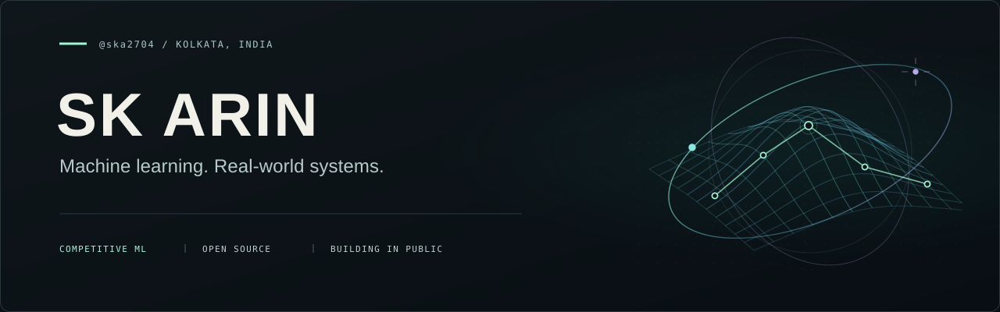

  

  <b>AI/ML contributor at Shipd · Kaggle Notebook Expert · CSE (AI &amp; ML) undergrad</b>

  
  &nbsp;
  

I build ML systems, compete in machine learning challenges, and design new problems for other people to solve. At **Shipd by Datacurve**, I work on both sides of the leaderboard: authoring challenges and developing solutions.

My workflow: **understand the data → build a reliable validation setup → experiment → ship.** I'm especially interested in NLP, computer vision, structured prediction, and the engineering that makes models useful.

## Selected builds

<table>
  <tr>
    <td width="50%" valign="top">
      01 / RACE SIMULATION
      <h3><a href="https://github.com/ska2704/PitWall">PitWall ↗</a></h3>
      
What happens when you put machine learning on the pit wall? A Formula 1 simulator with six ML models, historical telemetry, and Monte Carlo race scenarios.

      
<code>scikit-learn</code> <code>FastF1</code> <code>FastAPI</code> <code>React</code>

    </td>
    <td width="50%" valign="top">
      02 / OBSERVABILITY
      <h3><a href="https://github.com/ska2704/podmind">PodMind ↗</a></h3>
      
A Kubernetes observability dashboard connecting CPU anomaly detection, eBPF dependency graphs, and natural-language questions through a local LLM.

      
<code>Kubernetes</code> <code>Cilium</code> <code>Ollama</code> <code>Python</code>

    </td>
  </tr>
  <tr>
    <td width="50%" valign="top">
      03 / MOLECULAR ML
      <h3><a href="https://github.com/ska2704/hybridtox">HybridTox ↗</a></h3>
      
Exploring molecular toxicity prediction with graph attention networks, a variational quantum circuit, and a classical baseline across 12 Tox21 assays.

      
<code>PyTorch</code> <code>PyG</code> <code>PennyLane</code> <code>RDKit</code>

    </td>
    <td width="50%" valign="top">
      04 / KNOWLEDGE GRAPHS
      <h3><a href="https://github.com/ska2704/axiom">Axiom ↗</a></h3>
      
Turning academic PDFs into knowledge graphs, then using graph relationships to generate assessment questions and select their distractors.

      
<code>Neo4j</code> <code>Hugging Face</code> <code>FastAPI</code> <code>Streamlit</code>

    </td>
  </tr>
</table>

## In the lab

- **Competitive ML:** experiments across language, vision, and structured data, with validation and error analysis driving the next iteration.
- **Challenge design:** new task formulations on niche datasets, with careful evaluation and reproducible pipelines.
- **Open source:** building a contribution practice around the tools I use, starting with focused fixes and useful tests.

## Tools I reach for

**Models &amp; data** &nbsp; `Python` `PyTorch` `Transformers` `timm` `scikit-learn` `LightGBM`

**Systems &amp; interfaces** &nbsp; `FastAPI` `React` `TypeScript` `Docker` `Kubernetes`

  
<b>A little beyond the code</b>

  
Based in Kolkata. Studying computer science with a focus on AI and ML. Usually alternating between model experiments, photography, anime, and a run or a lifting session.

---

  Curious problems. Careful experiments. Useful software.

